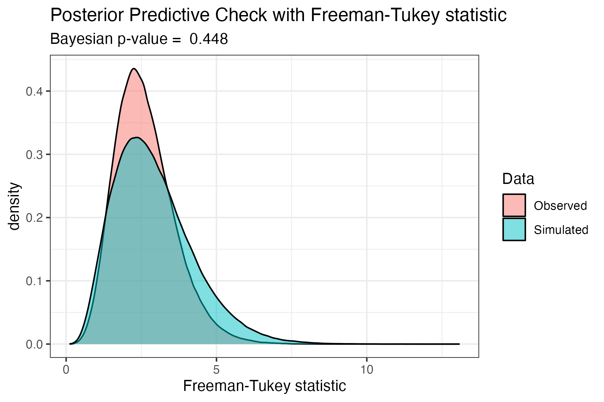
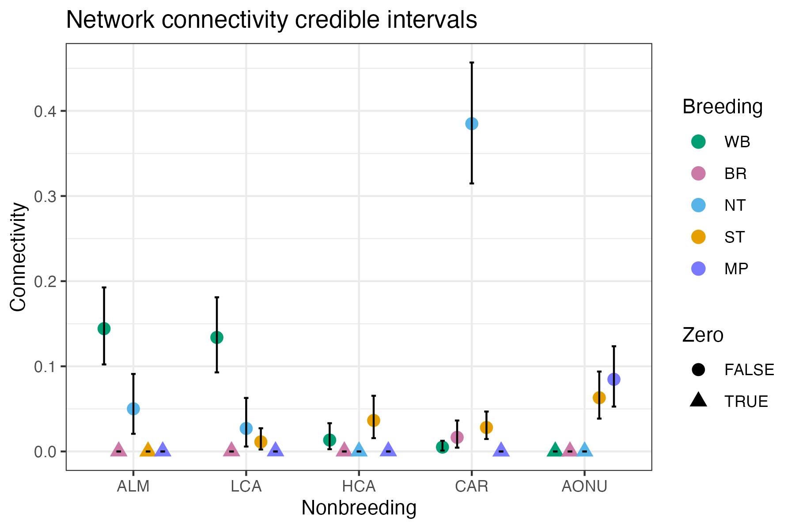
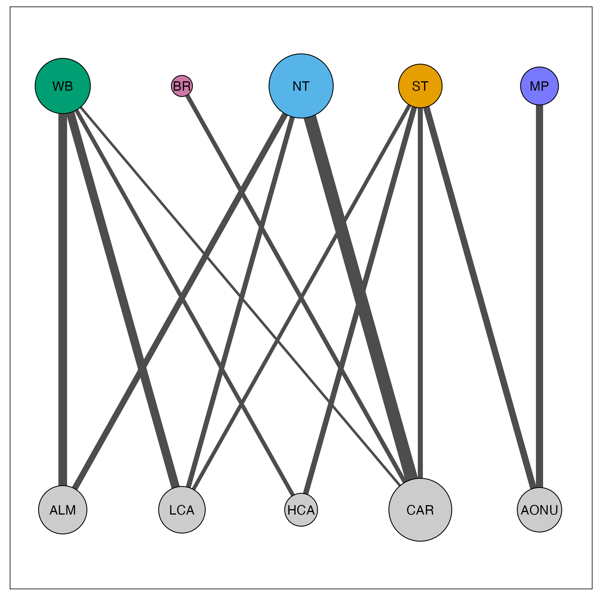

# Quick start example {#quickstart}

Here, we demonstrate a quick example of how to create a migratory network when the user has all of the data required. To run this tutorial, load the following packages:

```r
library(tidyverse)
library(mignette)
library(rjags)
library(jagsUI)
library(ggnewscale)
```

The data required are:

* Abundance
* Migratory connectivity

We provide an example of these data in `mignette`, with migratory connectivity data from 5 breeding nodes (WB = Western Boreal, NT = Northern Temperate, ST = Southern Temperate, BR = Basin Rockies, MP = Maritime Provinces) and  5 nonbreeding nodes (ALM = Atlantic Lowland Mexico, CAR = Caribbean, AONU = Amazon/Orinoco-Northern Uplands, HCA = Highland Central America, LCA = Lowland Central America) for the American Redstart (*Setophaga ruticilla*). The migratory connectivity data specifies the number of individuals that have been sampled or detected that migrate between different populations (i.e. *connect* the nodes).

```r
mignette::amre_assign
```

```{r, echo=FALSE}
knitr::kable(mignette::amre_assign)
```

We also provide the abundance of these nodes:

```r
mignette::amre_abundance
```

```{r, echo=FALSE}
knitr::kable(mignette::amre_abundance)
```

**Network model**

For the following functions, we specify the order of the nodes we are using for the model. Here, we are just ordering nodes geographically by longitude to facilitate straightforward interpretation of the output.

```{r}
brnode_names <- c("WB", "BR", "NT", "ST", "MP")
nbnode_names <- c("ALM", "LCA", "HCA", "CAR", "AONU")
```

For the American Redstart migratory network, we use `model = BR` which specifies that nonbreeding nodes are the “encounter” season and breeding nodes are the “recovery” season (i.e., inferred). This output saves the model as `amre.genetic.model_BR.txt`. Below we specify `parallel = TRUE` to run MCMC on multiple cores and use the remaining defaults. This step is computationally intensive and takes ~2 minutes to run on a 2023 MacBook Pro with an Apple M2 Pro chip.


```r
network_model <- run_network_model(abundance = amre_abundance, 
                           nb2br_assign = amre_assign,
                           brnode_names = brnode_names, 
                           nbnode_names = nbnode_names,
                           model = "BR", base_filename = "amre.genetic",
                           parallel = TRUE)
```

The first component of the output, `[[“conn”]]`, is an R tibble object of the mean connectivity estimated between nodes (Table 1). These values are interpreted as the proportion of individuals the global population that migrate between the corresponding populations, as such all of the values in the network matrix sum to one. The second component, `[[“jags_out”]]`, is the full output from `jagsUI::autojags()` provided as a list object, which contains important model information such as parameter estimates and credible intervals, model specifications, and goodness of fit. The final two components, `[[“brnode_names”]]` and `[[“nbnode_names”]]`, store the node names corresponding to the rows and columns, respectively, of the connectivity matrix.

```r
network_model$conn
```

```{r, echo=FALSE}
conn_ex <- mignette::amre_conn
rownames(conn_ex) <- NULL
conn_ex <- tibble::as_tibble(conn_ex) 
conn_ex <- tibble::add_column(conn_ex, "Breeding" = brnode_names, .before = 1)
knitr::kable(conn_ex)
```


The second component is the full output from [`*jagsUI* autojags()`](https://rdrr.io/cran/jagsUI/man/autojags.html) and is accessed by `network_model$jags_out`. Here, the raw connectivity matrix (i.e., mean *conn_g* estimates) can be accessed:

```r
amre_conn <- network_model$jags_out$mean$conn_g
amre_conn
```

```{r, echo = FALSE}
amre_conn <- mignette::amre_conn
rownames(amre_conn) <- NULL
colnames(amre_conn) <- NULL
knitr::kable(amre_conn)
```

**Check parameter convergence**

`mignette` users should familiarize themselves with the [`*jagsUI* autojags()`](https://rdrr.io/cran/jagsUI/man/autojags.html) output in order to evaluate the network model appropriately. For example, all parameters of the model should converge (*Rhat* < 1.1) and this can be double-checked by counting the number of instances where there are *Rhat* values greater than or equal to 1.1 with:

```r
sum(network_model$jags_out$Rhat$conn_g >= 1.1)
[1] 0
```

In this case, all of the *Rhat* values for the connectivity estimates were less than 1.1 and thus the result was 0 - all parameters converged! In the absence of convergence, the MCMC iterations may need to be increased. 

**Check goodness of fit**

In *mignette*, we implement a posterior predictive check using the Freeman-Tukey discrepancy statistic to compare the fit of the observed data to simulated data from the model, following the guidelines of [Conn et al. (2018)](https://doi.org/10.1002/ecm.1314). In the network model output, the posterior predictive check parameters are: 1) FT.obs = the Freeman-Tukey statistic for observed data, and 2) FT.rep = the Freeman-Tukey statistic for simulated data. The function `get_FT_fit()` produces a density plot of the Freeman-Tukey statistics for qualitatively comparing observed and simulated data, as well as outputting the Bayesian p-value of the goodness of fit based on these distributions. Very small (<0.05) or large (>0.95) Bayesian p-values suggest a lack of fit of the model. For a full discussion of checking Bayesian models, see Conn et al. (2018).

We can then look at the posterior predictive check of the American Redstart mode using the code below, which shows largely overlapping distributions of the Freeman-Tukey discrepancy statistics for the observed and simulated data, with a corresponding Bayesian p-value of 0.58 - indicating sufficient goodness of fit.

```r
get_FT_fit(network_model)
```

```{r, echo = FALSE}

```

**Uncertainty in the connectivity estimates**

The network model output provides credible intervals in addition to the mean of the connectivity estimates. Uncertainty in the network connectivity estimates is characterized by the credible intervals provided in the network model output for the conn_g parameter. The mignette function `plot_network_CI()` plots the mean and 95% credible intervals for network connectivity which allows users to assess the uncertainty in the estimates. 

```
plot_network_CI(network_model = network_model, stage = “Breeding”, 
stage_colors = brnode_colors, overlap = TRUE)
```

```{r, echo = FALSE}

```


**Visualize network**

The raw connectivity matrix is used to plot the network. We plot the migratory network  with the provided `mignette` functions `net_create()` and `net_draw()`. We set `connected_tol = 0.01` which plots only the edges with connectivity values of greater than 0.01.

```r
amre_net <- net_create(network_model = network_model,
                       margin = 0.05)
#set the display size range for nodes (min and max), default 1-10
amre_net$display_par$node_size_scale <- c(8,25)
#set the display size range for edges (min and max), default 1-10
amre_net$display_par$edge_size_scale <- c(1,5)
# change colors
amre_net$display_par$brnode_colors <- c("#009e73", "#cc79a7", "#56b4e9", "#e69f00", "#7979ff")
amre_net$display_par$nbnode_colors <- "grey80"

net_draw(amre_net)
```

```{r, echo = FALSE}

```

In this visualization, node size corresponds to the amount of connectivity with that population and edge size corresponds to the amount of connectivity between the populations. Breeding populations are in the top row, for which we provided custom colors, and nonbreeding populations are in the bottom row.

This sums up the basics of creating and visualizing a migratory network. We encourage users to explore and build upon the visualization tools we provide (e.g. overlay the migratory networks on geographic ranges) - the options are endless, enjoy!

